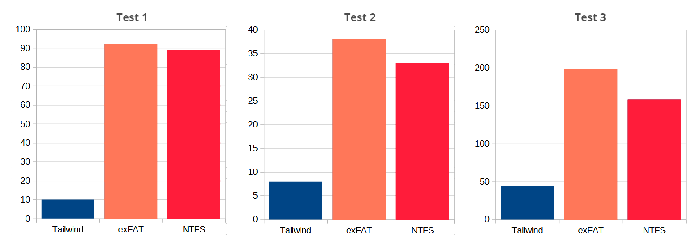

# Tailwind File System

TL;DR Tailwind is a pre-alpha, very lean file system driver, currently Windows
only. Although it is in crude shape, it can run major applications, and some applications run over three times as fast as when run under either exFAT or NTFS.

### Why a New Filesystem?

Tailwind is a pet project of mine, a Windows File System Driver. It has
been in the works for years, and, as of 2024, is still very crude, not
complete and maybe never to be completed, as Windows file system
development is very complicated and hurts my head (and many other people's heads) greatly. It was born of the notion that a fresh file system built taking into account the capabilities of modern computers, and not the capabilities from the 1990's (as NTFS and FAT were) would be much more capable.

| Year | Clock    | RAM      | Storage   | Access    |
|:----:| --------:| --------:| ---------:| ---------:|
| 1995 | 75 MHz   | 8 MB     | 500 MB    | 10 MB/s   |
| 2024 | 3000 MHz | 16000 MB | 521000 MB | 6000 MB/s |

So, since your file system was designed, your computer has become, crudely, 300 times faster, gained 2000 times more memory, and 1000 times more storage that is 1000 times faster. And, so, for example, I did not worry about consuming hundreds of MB of RAM, where as computers when NTFS was designed didn't have nearly that much memory in total!

## Tailwind vs exFAT vs NTFS: a Speed Comparison

### Target Software Used

- **Tailwind**: Tailwind version 2.0.21.20, built on 2024-07-22

- **VLC**: VLCPortable_3.0.18.paf.exe

- **FF**: FirefoxPortable_91.0.1_English.paf.exe

- **BBB**: bbb.webm (A 5 second clip of Big Buck Bunny, 902KB)

- **OS**: Windows 10 Pro 22H2

### Target Hardware Used

- **Computer**: Dell Studio 1569 laptop, M430 Core i5 CPU at 2.27 GHz, 8 GB RAM, USB2.0

- **Drive**: Micro Center USB3.1 64GB thumb drive

### Tests

Three tests were timed using each of three file systems, Tailwind,
exFAT, and NTFS. The tests were convenient, as they are the tests used
to check Tailwind versions for functionality.

**Test 1.** On a freshly formatted thumb drive, after reboot, using a
batch script, install VLC, launch it, play BBB, and exit.

**Test 2.** After rebooting the computer, launch VLC again.

**Test 3.** From the desktop, drag and drop FF onto the E: drive, run
the installer, and after the install completes, open the Firefox folder,
double-click the exe, wait for the home page to draw.

### Test Times in Seconds

| Test                                           | Tailwind | exFAT | NTFS |
| ---------------------------------------------- | --------:| -----:| ----:|
| 1. Install, launch VLC, play BBB, and exit     | 10       | 92    | 89   |
| 2. From a reboot, relaunch VLC                 | 8        | 38    | 33   |
| 3. Drop FF installer, run installer, launch FF | 44       | 198   | 158  |

### Target Audience

I have satisfied myself that there is a lot of room for play and innovation, and I am ready to be done with it. But I don't want to throw it away, so I am putting it in a repository. Maybe it can be improved to be a capable file system, or maybe you want to try something with file systems, and don't want to start from scratch.  So here you go\...

### Quick Start

- Set up a Windows driver development environment with a Client computer and a Target computer.  
  See "Steps to Set Up the Target Machine.md" and "Steps to Set Up the Client Machine.odt" for more detail.
- On the Client computer, build the 3 Visual Studio projects, increment the version in the tailwind.inf file, run "Sign_DebugPackage_Admin.bat" to test sign the driver.
- Copy the created DebugPackage folder and format.exe to the Target computer.
- Right-click tailwind.inf, and choose "install".
- Reboot.
- Run "format.exe E:"
- Start up WinDbg on the Client computer, if you wish.
- As admin, run "sc_start_tailwind_ADMIN.bat"

### There Are Many Things That Need Work

- Need to use per-volume values instead of globals.
- Need to add appropriate checks for passed parameters.
- One major speed tactic is that I return SUCCESS for a volume flush then, start in on it. I then expect to be able to wait to finish, if need be, on a dismount request. I am not so sure I can get away with this.
- Sometimes, after reboot, initiation of playback of BBB in VLC hangs. Oops. Retrying always works.
- Need to use a more sophisticated system for metadata storage, and update; currently metadata is a fixed address and size on volume, and changes are recorded by writing the entire metadata block.
- Address the roughly 150 TODOs marked in the code.
- The volume formatter basically just stomps on the first sector in such a way that no driver but ours will recognize it, and that we will recognize that it has no data on it yet. If I were smart, I would know the proper way to do this.
  (And, this is not an exhaustive list; just the list that I can think of just now, so yeah.)

### Project Folders

- **BuildDriver**: Builds tailwind.sys, the driver.
- **BuildChatUtility**: Builds Chat.exe, a utility that communicates with the driver.
- **BuildFormatUtility**: Builds Format.exe, a very crude volume "formatter".
- **ClientStuff**: A place for stuff that might be useful on the client side.
- **TargetStuff**: A place for stuff that might be useful on the target side.
- **SignDriver**: Signs tailwind.sys and groups it with tailwind.cat and tailwind.inf
